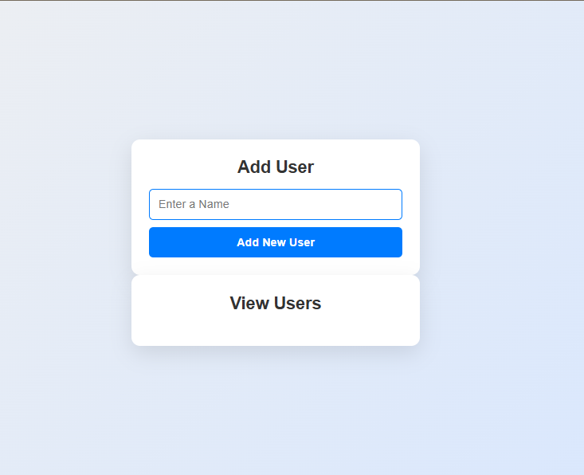
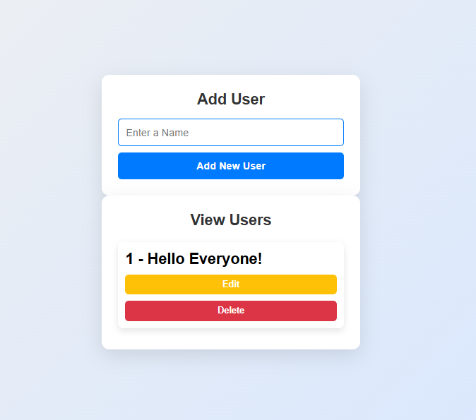
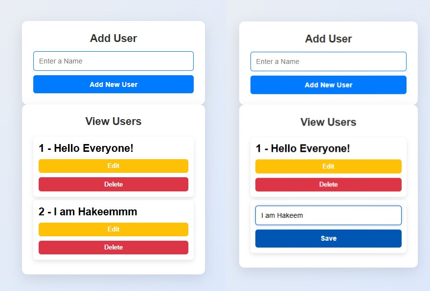

# 🚀 Redux User Manager

A simple and responsive **React + Redux Toolkit** app to **Add, View, Edit, and Delete Users** — all with beautiful UI and state management using Redux!

---

## 🖥️ Demo Preview



🔗 [View Live Website](https://abdulhakeemhak.github.io/hakfolio/)

---

## 📌 Features

✅ Add a new user  
✅ View all added users  
✅ Edit a user's name  
✅ Delete a user  
✅ Form validation (no empty input)  
✅ Fully responsive and clean UI

---

## 🛠️ Built With

- 🔥 **React**  
- ⚙️ **Redux Toolkit**  
- 🎨 **CSS Flexbox + Media Queries**  
- ❤️ **Poppins Font**

---

## 📸 Screenshots

| Add User | View & Edit |
|----------|-------------|
|  |  |

---

## 🚀 Getting Started

```bash
# Clone the repo
git clone https://github.com/abdulhakeemhak/redux-state-management-demo.git

# Navigate into the project
cd redux-state-management-demo

# Install dependencies
npm install

# Start the app
npm start

redux-user-manager/
├── public/
│   └── index.html
├── src/
│   ├── components/
│   │   ├── UserForm.jsx
│   │   └── UserList.jsx
│   ├── redux/
│   │   └── UserSlice.js
│   ├── store.js
│   ├── App.js
│   └── index.js
├── Redux.css
├── .gitignore
├── screenshots/
├── package.json
└── README.md
